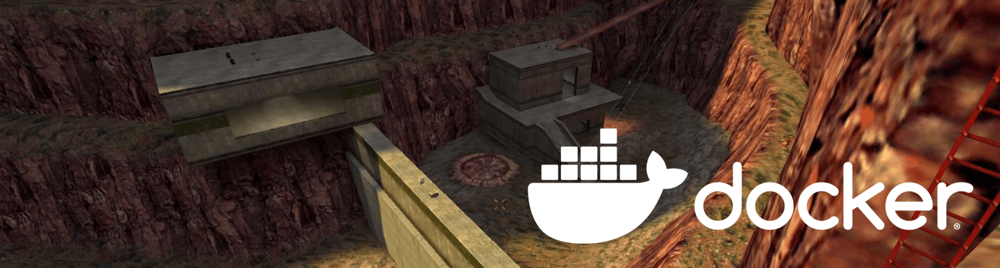

# ReHLDS Docker Counter-Strike 1.6 Server

## Half-Life Dedicated Server as a Docker image

Probably the fastest and easiest way to set up an old-school Counter-Strike 1.6 server.
Both Steam and noSteam, old and new
half-life clients can connect and play together! You don't need to know
anything about Linux or ReHLDS to start a server. You just need Docker and
this image.

## Quick Start
You can choose to start with my example server configuration:
```bash
cd server-example
docker compose up -d
```

Or start a new fresh server by running:
```bash
docker run --name "cstrike" -p 27015:27015 -p 27015:27015/udp dimankiev/rehlds-cstrike
```

This will create a container named "cstrike" with the 27015 port open (on UDP and TCP).

## What is included

* [ReHLDS Build](https://github.com/dreamstalker/rehlds) `3.13.0.788`.

  ```
    Protocol version 48
    Exe version 1.1.2.7/Stdio (cstrike)
    Exe build: 07:36:33 Jul 12 2023 (3378)

  ```

* [Metamod-r](https://github.com/theAsmodai/metamod-r) version `1.3.0.138`

* [AMX Mod X](https://github.com/alliedmodders/amxmodx) version `1.8.2`

* [ReAPI](https://github.com/s1lentq/reapi) version `5.24.0.300`
* [ReGameDLL_CS](https://github.com/s1lentq/ReGameDLL_CS) version `5.26.0.668`

* Patched list of master servers (official and unofficial master servers
  included), so your game server appear in game server browser of all the clients

* Minimal config present, such as `mp_timelimit` and mapcycle

## Default mapcycle

* de_dust2
* de_inferno

## Credits
This repository was based on fork of HLDS server repo
https://github.com/BLSAlin/rehlds-cstrike
I just decided to enhance example server configuration, bump dependencies and fix the image.
